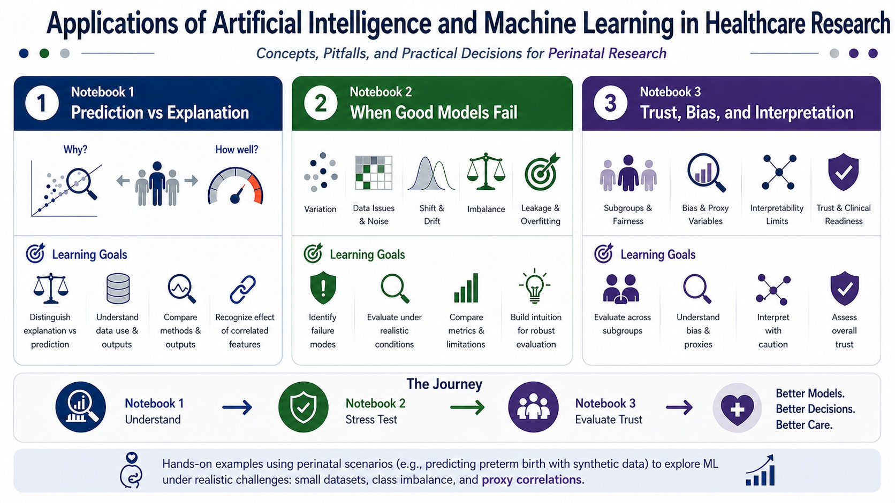

# Practical Machine Learning for Healthcare Research

Concepts, pitfalls, and practical decisions in healthcare machine learning.

## Overview

This repository contains a short, concept-driven course on machine learning in healthcare research, with examples grounded in perinatal research using synthetic but clinically inspired data. Using interactive experiments with synthetic perinatal datasets, learners investigate how models behave under realistic conditions such as small sample size, class imbalance, proxy correlations, data leakage, missing data, subgroup imbalance, and distribution shift.

The course is delivered through self-contained, illustrated, Google Colab–ready notebooks that emphasize intuition, practical evaluation, and critical thinking rather than exhaustive coverage of algorithms.


## Open in Colab

| Notebook | Topic | Colab |
| --- | --- | --- |
| 1 | Prediction vs explanation | [Open in Colab](https://colab.research.google.com/github/sunilkalmadi/healthcare-ml-course/blob/main/notebooks/notebook_1_prediction_vs_explanation_colab.ipynb) |
| 2 | Generalization and failure modes | [Open in Colab](https://colab.research.google.com/github/sunilkalmadi/healthcare-ml-course/blob/main/notebooks/notebook_2_generalization_and_failure_modes_colab.ipynb) |
| 3 | Trust, bias, and interpretation | [Open in Colab](https://colab.research.google.com/github/sunilkalmadi/healthcare-ml-course/blob/main/notebooks/notebook_3_trust_bias_and_interpretation_colab.ipynb) |

## Notebook Progression

1. **Prediction vs Explanation**  
   Compares predictive modeling goals with explanatory interpretation in a clinical risk prediction setting.

2. **Generalization and Failure Modes**  
   Demonstrates how sample size, noise, imbalance, data leakage, missingness, and distribution shift affect model behavior.

3. **Trust, Bias, and Interpretation**  
   Examines subgroup performance, thresholds, calibration, and interpretation limits in healthcare ML.

<p align="center">
  
</p>

## Audience

This course is designed for clinicians, researchers, trainees, and health data science learners who want to critically design, evaluate, and interpret machine learning applications in healthcare. No advanced machine learning background is assumed.

## Synthetic Data Note

The notebooks use synthetic perinatal datasets. These data are not patient records and should not be interpreted as epidemiologic estimates. They are designed to make model behavior visible under controlled, clinically plausible conditions.

## Repository Contents

```text
healthcare-ml-course/
|-- notebooks/
|   |-- notebook_1_prediction_vs_explanation_colab.ipynb
|   |-- notebook_2_generalization_and_failure_modes_colab.ipynb
|   `-- notebook_3_trust_bias_and_interpretation_colab.ipynb
|-- docs/
|   `-- Data_Generator_Student_Guide.md.docx
|-- figures/
|-- README.md
|-- LICENSE
`-- CITATION.cff
```

## Author

Sunil Kalmady Vasu, PhD  
Adjunct Professor, Computing Science  
University of Alberta, Edmonton, Canada  
kalmady@ualberta.ca

## Citation

If you use or adapt these materials, please cite this repository using the metadata in `CITATION.cff`.

